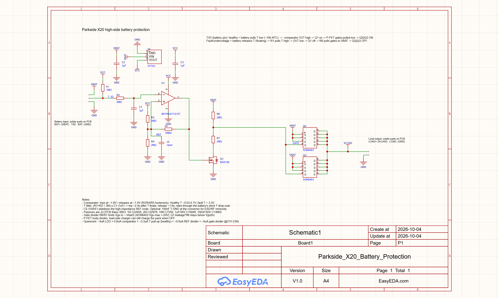
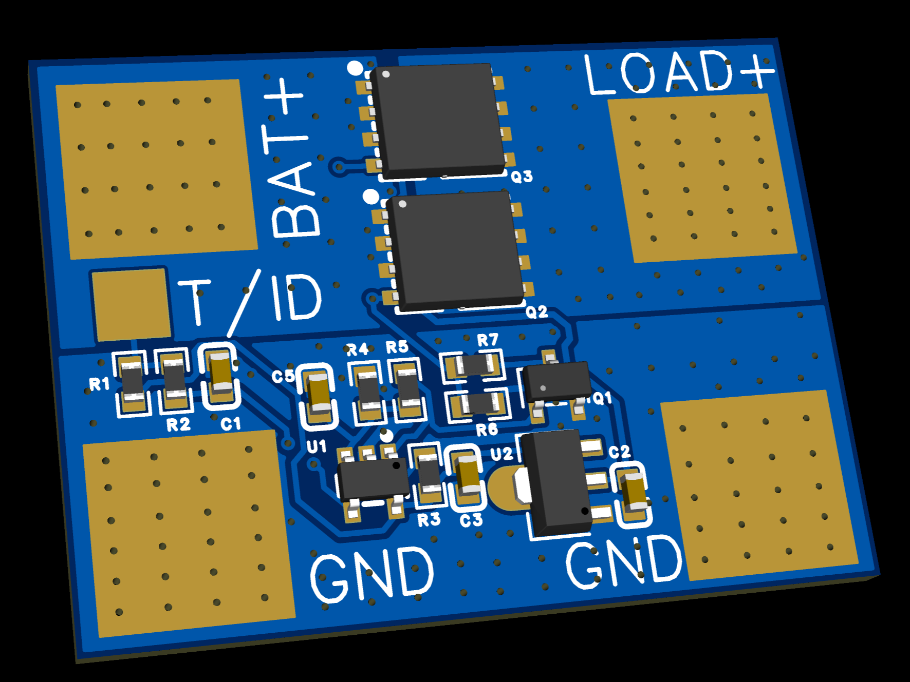
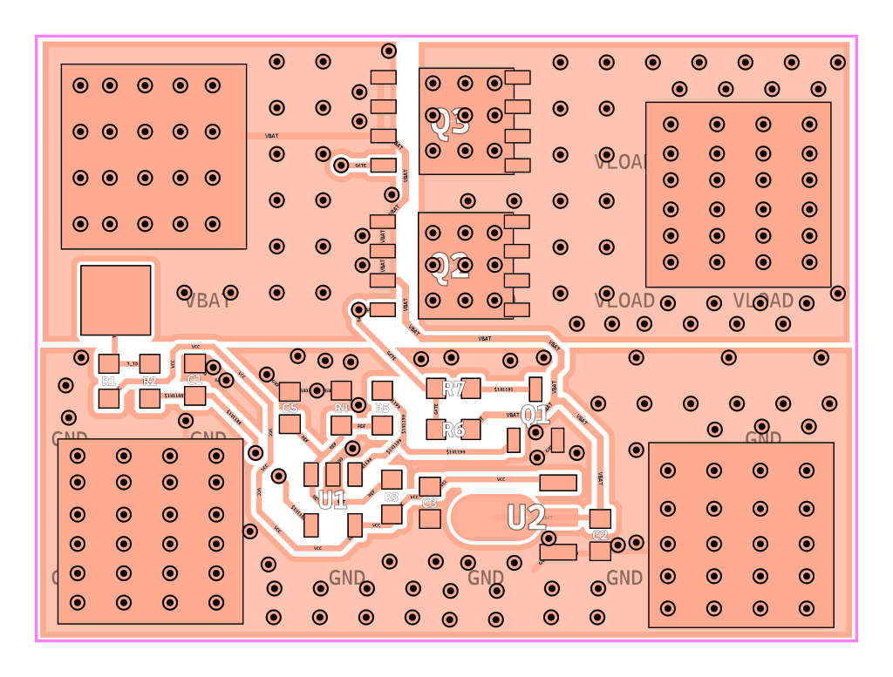
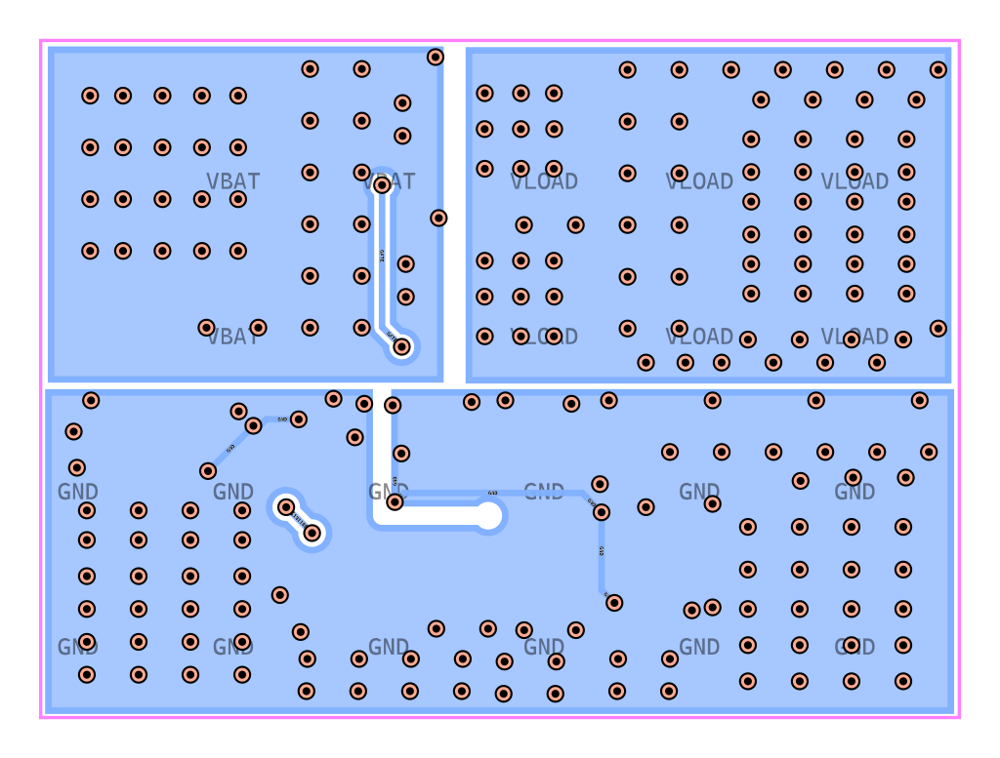
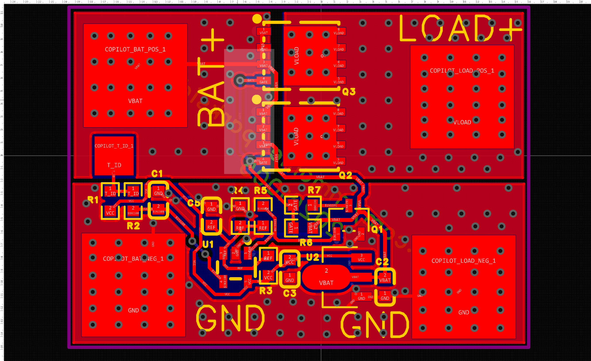

# Parkside X20 Battery Protection

High-side battery protection board for Parkside X20 Team batteries. It watches the battery's
T/ID pin and switches the battery's positive rail to the load with two parallel P-channel
MOSFETs. When the battery reports a fault, the rail is cut. The whole control circuit is built
for a quiescent current of a few microamps.

**Status: designed and DRC-clean in EasyEDA Pro, not built or tested.** See
[Open points](#open-points-verify-before-building).

- Project file: `Parkside_X20_Battery_Protection.eprj2` (EasyEDA Pro, open it with File > Open)
- Board: 2 layers, about 35.6 x 26.3 mm, all parts on the top side
- Connections: five SMD solder pads for wires (no connectors)

## Schematic



## PCB

3D view of the top side:



Top layer (copper pours, parts, vias):



Bottom layer (GND pour, gate route, vias):



Full editor view with all layers and silkscreen:



## How it works

The T/ID pin of an X20 battery behaves like this (reverse-engineered by others, see
[Sources](#sources)):

| Battery state | T/ID pin |
|---|---|
| Healthy | Pulled to GND through about 10 kOhm (NTC and a transistor) |
| Fault (undervoltage, overcurrent) | Released, floating |

So: **T/ID pulled low means run, T/ID floating means off.**

```
BAT+ ---+------------------------+------ Q2 || Q3 (AON6403, P-FET) ------ LOAD+
        |                        |   source=BAT+, drain=LOAD+
        +-- HT7333 -> 3.3 V (VCC) +-- R6 pulls both gates to BAT+ (switch OFF by default)
                                       |
T/ID --+-- R1 1M to VCC               gate net --- R7 --- Q1 (BSS138) --- GND
       +-- R2 2M -- C1 1uF -- comparator IN-             |
                                       U1 (MCP6541) OUT -+  (high = Q1 on = switch ON)
REF = 3.3 V divider R3/R4 (2M/2M) with R5 10M hysteresis, C5 100nF on REF
```

1. R1 (1 MOhm) pulls T/ID up to 3.3 V. A healthy battery pulls it down to about 0.03 to 0.1 V.
2. R2 and C1 low-pass the signal. The battery drops T/ID briefly every so often, and the filter
   ignores those drop-outs.
3. U1 (MCP6541) compares the filtered T/ID with REF. T/ID below REF gives an output high, which
   turns Q1 on, which pulls the gates of Q2 and Q3 low, which closes the switch.
4. If the battery releases T/ID, the filtered voltage rises above REF, Q1 turns off, R6 pulls the
   gates back to BAT+, and the switch opens.
5. The P-FET body diodes point from LOAD+ to BAT+, so a charger on the load side can still charge
   the pack while the switch is off.

### Key numbers

| Item | Value |
|---|---|
| Comparator trip / release threshold | about 1.8 V / 1.5 V (R3, R4, R5 hysteresis) |
| Healthy T/ID / fault T/ID | 0.03 to 0.1 V / 3.3 V |
| Filter (R1 + R2 = 3 MOhm, C1 = 1 uF) | trips about 2.4 s after T/ID floats, releases about 1.6 s |
| Gate drive | R6/R7 (2 MOhm each) limit Vgs to about -Vbat/2 (AON6403 limit is +-20 V) |
| Estimated quiescent current | about 5 uA with the switch off, about 14 uA on at 21 V (LDO 4 uA, comparator 0.6 uA, T/ID pull-up 3.3 uA, REF divider 0.8 uA, gate divider 5 uA) |

The estimates are from calculation, not measurement.

## Connections (solder pads)

| Pad | Net | Position on the board |
|---|---|---|
| BAT+ | VBAT | left edge, top |
| T/ID | T_ID | left edge, middle (small pad) |
| BAT- | GND | left edge, bottom |
| LOAD+ | VLOAD | right edge, top |
| LOAD- | GND | right edge, bottom |

The large pads are 8 x 8 mm for heavy wire. The vias on those pads are left open (not tented)
on purpose, so solder will flow into them. All other vias are tented.

## Bill of materials

Passives are JLCPCB **Basic** 0603 parts. The ICs are JLCPCB **Extended** parts.

| Designator | Value | Part | LCSC | Class |
|---|---|---|---|---|
| R1 | 1 MOhm | UNI-ROYAL 0603WAF1004T5E | C22935 | Basic |
| R2, R3, R4, R6, R7 | 2 MOhm | UNI-ROYAL 0603WAF2004T5E | C22976 | Basic |
| R5 | 10 MOhm | UNI-ROYAL 0603WAF1005T5E | C7250 | Basic |
| C1, C2, C3 | 1 uF 50 V X5R | Samsung CL10A105KB8NNNC | C15849 | Basic |
| C5 | 100 nF 50 V X7R | Yageo CC0603KRX7R9BB104 | C14663 | Basic |
| U1 | comparator | Microchip MCP6541T-E/OT | C2980237 | Extended |
| Q1 | N-FET | BSS138 (YFW) | C19626400 | Extended |
| Q2, Q3 | P-FET, 30 V | Alpha & Omega AON6403 | C2760089 | Extended |
| U2 | 3.3 V LDO | HT7333 (SOT-89) | C55349160 | Extended |

C4 does not exist; the numbering skips it.

## Board layout notes

- Q2 and Q3 sit in a straight line between the BAT+ pad and the LOAD+ pad. Their sources and gates
  face the battery, their drains and thermal tabs face the load.
- VBAT and VLOAD are wide top-layer copper pours. GND is poured on both layers and stitched.
- The gate net runs on the bottom layer through three vias beside the pads, so the top copper
  between the Q2 and Q3 sources stays unbroken.
- Pours use solid connections to pads and vias (no thermal-relief spokes).
- Copper weight is not stored in the project. The routing assumed 1 oz.

## Open points (verify before building)

1. **Current capacity.** The high-current path is mostly single-layer top copper. For tool currents
   (tens of amps), order 2 oz copper, expect the FETs to run warm, and check the pads' wire
   solder joints. The AON6403 is rated 30 V, which is fine for a 21 V pack.
2. **T/ID wake-up.** Another source says the battery turns its output off if it sees no voltage on
   T/ID. R1 is 1 MOhm to keep the current low, so T/ID sits at only about
   0.03 V on a healthy pack, with just 3 uA flowing through R1. If a real pack does not stay awake
   with that, lower R1 to 100 to 220 kOhm (costs 15 to 30 uA).
3. **Start-up from a cut-off pack.** The control circuit is powered from BAT+. If the pack's own
   output is off, the board has no supply. This needs a test on a real pack.
4. **LDO input limit.** The HT7333 allows 24 V at the input. A 21 V pack leaves little margin for
   spikes.
5. **Schematic DRC.** EasyEDA reports 1 warning on the schematic. The API only returns a count;
   the text needs to be read in the editor (Design > Check DRC). The PCB DRC is clean.
6. **Optional ESD part.** A 100 nF capacitor from T/ID to GND at the pad would add ESD and RF
   immunity. It is not placed; there is only a note on the schematic.

## License

MIT, see [LICENSE](LICENSE). This is an untested hardware design: use it at your own risk. A
battery pack and a high-current switch can start a fire if built or used wrongly.

## Sources

- T/ID behaviour and an earlier low-side protection board:
  https://positron96.gitlab.io/projects/parkside-battery-protection/
- Other write-ups of the X20 T/DS pin: elektroda.com thread "Parkside X20V and 12V tools detect
  battery undervoltage via BMS and T/DS pin", and the Hackaday.io project "LIDL PARKSIDE Battery
  hacks".
